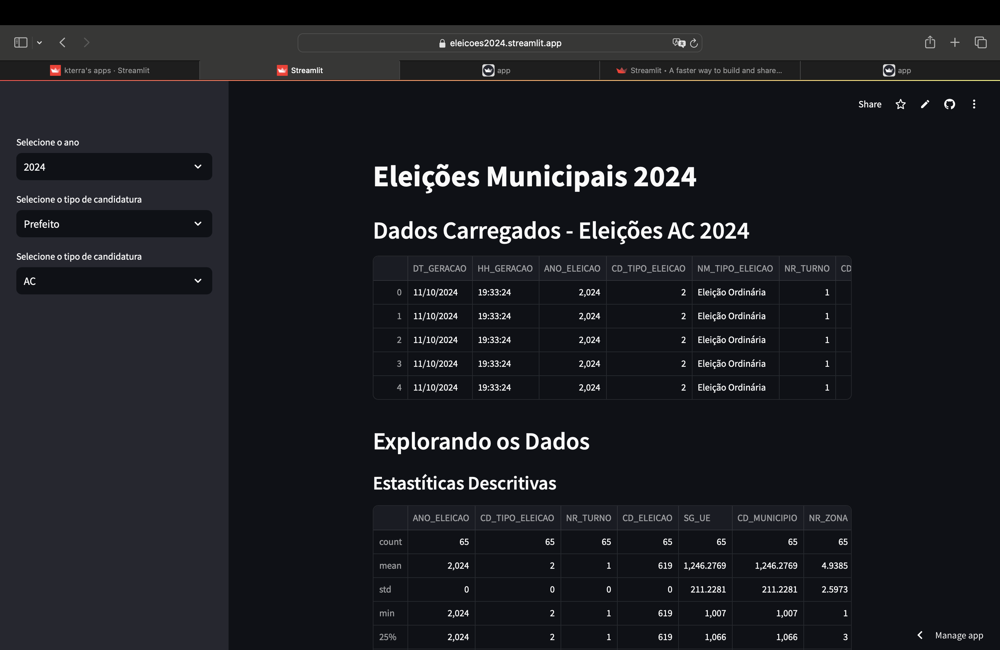

# Ferramenta de Análise dos Resultados das Eleições Municipais 2024

Tecnologias utilizadas: Python, Pandas, GeoPandas, Streamlit, Plotly, Matplotlib

## Dados Utilizados

Os arquivos utilizados na análise estão disponíveis nos links:
1. [Repositório de Dados Eleitorais - Votação Nomital por Candidato e Zona (2016,2020,2024)](https://dadosabertos.tse.jus.br/dataset/?tags=Ano+2024)
2. [Partidos 2024](https://github.com/programacaodinamica/analise-dados/blob/master/dados/partidos2024.csv)
3. [ShapeFiles Municipios](https://www.ibge.gov.br/geociencias/organizacao-do-territorio/malhas-territoriais/15774-malhas.html)